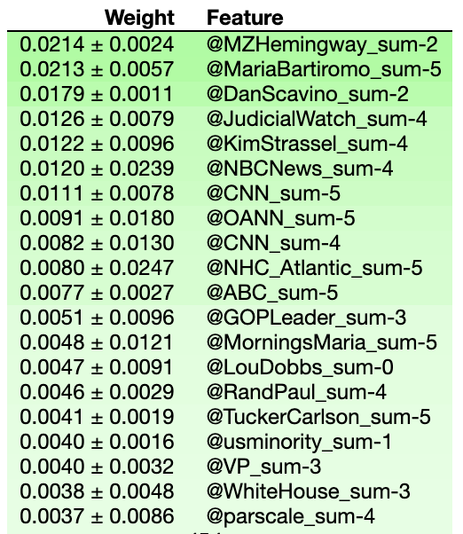
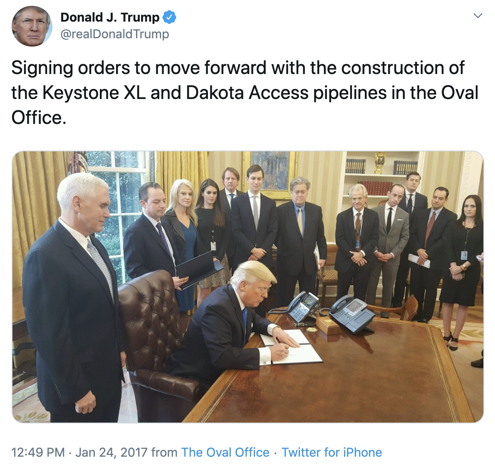
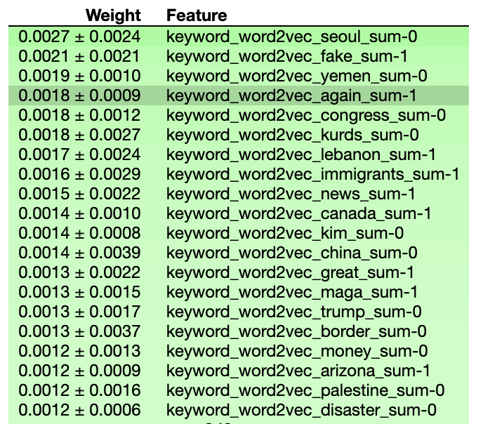

---
title: Analysis 
layout: default
filename: analysis.md
--- 

##### Models: 

Several top-performing models were selected for further analysis, in order to obtain insight into the underlying mechanism of prediction. 

Although the predictive power of these models is, in general, small, 
we feel that any ability to reproducibly explain the massive complexity of the global stock market is exciting and worthy of further study. 

###### Stocks:

The top-performing model for predicting Chinese stocks used Trump's frequent Twitter mentions in combination with a 5-day lookback to lower the mean absolute error by approximately 18%
(relative to a *y*-randomized model). 
Using `eli5`'s predictor importance feature (which shuffles various predictors and observes the loss in efficacy), the most important predictors could be extracted (Figure xx).

{:height="350px"}

**Figure xx**: Top Predictors of Chinese Stock Variance

Notably, two contributors to Fox News occupied the top positions (Mollie Hemingway and Maria Bartiromo), with other news sources (NBC, CNN, ABC) featuring prominently as well. 
It is plausible that Trump mentions these people disproportionately when significant news events are occuring (which will concomitantly impact the Chinese stock market),
but more research and experimentation is needed before conclusive results can be obtained. 

{:width="500px"}

**Figure xx**: A sample tweet (@MariaBartiromo) which might impact Chinese stock volatility

###### Gold Prices:

As a safe alternative to stocks or bonds which holds its value even through total state collapse, the price of gold historically tracks with economic uncertainty. 
The top-performing model for predicting gold prices was based on topic analysis done by `word2vec` (as described previously), which permitted facile extraction of the most important topics 
(Figure xx).

{:height="350px"}

**Figure xx**: Top Predictors of Gold Price Variance

Several `word2vec` topics were especially important in describing volatility in gold prices: tweets about China or Beijing, and tweets about Dakota. 
The first category presumably reflects the effect of the trade war on the US economy,
whereas the second likely refers to the booming oil industry of North Dakota (and the oil pipelines built there). 
Both of these topics would be expected to impact economic uncertainty significantly, and thus this model seems physically reasonable (Figure xx). 

{:width="500px"}

**Figure xx**: A sample tweet about North Dakota which might affect the economy

###### Ruble Exchange Rate:

The top-performing model for predicting volatility in the ruble exchange rate also used `word2vec` predictors. 
In contrast to the gold model, there were no "standout" predictors for the ruble variance model: 
instead, many predictors assumed roles of lesser importance. 
Foreign policy appeared to be a commonality, with tweets pertaining to South Korea, the Kurds, Yemen, Lebanon, and China seeming to have the biggest impact.

The considerable global influence wielded by Trump (and Russia) means that any bold foreign policy claims are likely to affect the Russian government, and thereby the Russian currency.
Accordingly, these predictors seem reasonable for describing volatility in the ruble/dollar exchange rate. 

{:height="350px"}

**Figure xx**: Top Predictors of Ruble/Dollar Exchange Rate Variance
