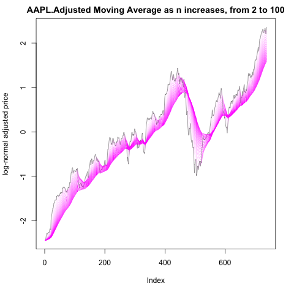
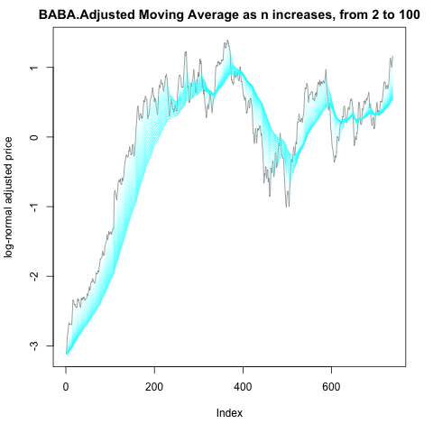
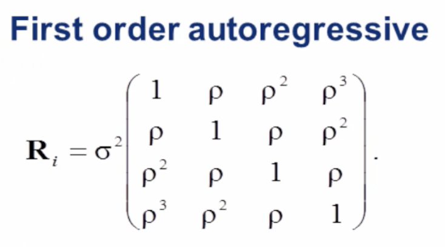

---
title: Future Work 
layout: default
filename: future_work.md
--- 

#### Future Work:

Although the initial results are promising, there is much that could be done to improve the quality of these data and strengthen the conclusions. 

##### Improved Data: 

Better and more random stock selection:
 - taking an average of more stocks (both a simple random sample and those which we picked which were particularly vulnerable to the trade war. We could also weight stocks by how much total money is being traded per stock, and make our weighted average thus.

###### Better Data Augmentation:

As mentioned previously ([*vide supra*](models.md)), applying purely numerical data augmentation to the final predictor set had

###### More Sophisticated Sentiment Analysis:

###### 

###### Response Variables:

Stocks:
There are several ways by which we could better model volatility.

The two easiest ways we could do to improve our response variable are:

Moving Averages
 - We have taken moving averages, but we haven't optimized the length of our moving average. However, given that Trump tweets so often, and many times a day, our prior belief was that his tweets would affect intraday prices or just a bit into the future. That is, our model's response variable implicitly assumes a short memory for tweets. But we haven't empirically tested this assumption and it could very well be that differences in moving averages for price would work better than our current response variable by helping to reduce noise. Optimizing the number of days over which to take a moving average could be seen as a hyper-parameter. 
 
 We used the moving average [movavg](https://www.rdocumentation.org/packages/pracma/versions/1.9.9/topics/movavg) function in R to produce the following plots over changing values over n days:
 
 
 
 
 
 
  
 
Because we used the exponential moving average call in R which "is a weighted moving average that reduces influences by applying more weight to recent data points () reduction factor 2/(n+1)", we did something very similar to auto-regression, which is described below:
 
Auto-Regression:
- a similar concept to moving averages is auto-regression. It similarly uses previous time steps to predict values at the next time steps.
Below is a [graphic](https://www.youtube.com/watch?v=0kaxO0r7PYs) of a first order autoregressive covariance matrix. Each observation is most correlated to the observation it is closest to in time. 

 

 
 Volume information and Momentum
 - In our model, we only looked at volatility as a function of price. However, we could also have included the volume coefficient in some way. We could add the volume term to our model's calculations, but given our log-normal assumptions and justifications for our response transformations, we would probably need to meet with teaching staff to discuss how to do this. Specifically, we did meet with Kevin Rader on Thursday december 5th, and he suggested a simple interday difference to get normal looking histograms for our response variable, which were demonstrated in the ([data](data.md)) section of this website.
 
 - If given more time, we would like to add a momentum term to the model, say to the coffefficient of volume as before. However, we can think of two associated hyper-parameters which would be associated with such a term: the power to which it would be raised as well as a λ (from regularization) analygous parameter we would need to tune. That is, beta*(Volume random variable) ^ (power coeffient). Optimization would again be challenging here.

Multiple Stock Response Variables
 - we could better split the response variables and consider response variable splits for example:
    - we could split stocks up by industry. For example, we could consider only farm stocks or only superconductor stocks.
    - we could split up stocks by country. The issue here is time difference. We only had inter-day data. Therefore if Trump tweets something about the trade war today, on 12/10, then it could be read as changing China's stock price on 12/11. This complicated our model in a such a way that we chose not to approach these more complicated country splits. Also, multiple response variables may have complex joint distributions which, given our collective backgrounds in CS 209a and stat 139 at Harvard, we don't necissarilly have to background to address.

##### More Sophisticated Models
