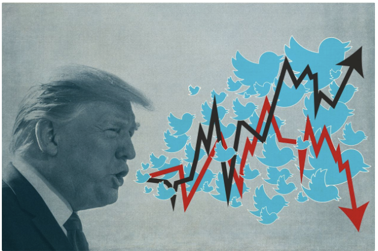

---
title: Intro 
layout: default
filename: intro.md
--- 
#### Introduction 

 
**Figure 1**: [Artistic representation](https://www.barrons.com/articles/donald-trump-twitter-stock-market-51567803655) of Trump's effect on the stock market.

No American President before Donald J. Trump has possessed so instantaneous and direct a line of communication with the public.
Through Twitter, Trump can quickly indicate to investors, businesses, and foreign powers what the executive policy of his administration will be, 
which can have concomitant (and drastic) effects on domestic and foreign markets. 

A few instances of this are shown below: 

**Figure 2**: [NBC headline](https://www.cnbc.com/2019/08/23/trump-says-hes-ordering-american-companies-to-immediately-start-looking-for-an-alternative-to-china.html) from August 23rd, 2019

On August 22nd, 2019, China anounced retaliatory tariffs against the United States as a part of the ongoing US/China trade war. 
Then at 9:59 the President tweeted "Our great American companies are hereby ordered to immediately looking for an alternative to China." 
According to CNBC, shortly thereafter "the Dow Jones Industrial Average fell more than 435 points, or 1.6%, while the S&P 500 slid 1.7% and the Nasdaq Composite dove 2%."
This demonstrates the virtually instant effect that Trump's utterances can have on market confidence. 

**Figure 3**: [MarketWatch headline](https://www.marketwatch.com/story/dow-surges-350-points-as-trump-tweets-of-extended-meeting-with-president-xi-on-trade-2019-06-18) from June 18th, 2019

Conversely, in June Trump tweeted "Had a very good telephone conversation with President Xi of China. We will be having an extended meeting next week at the G-20 in Japan",
which had a dramatic effect: the S&P 500 index (SPX) climbed 1.3%, while the Nasdaq Composite Index (COMP) advanced 1.8%.

These two anecdotes, while not by themselves conclusive, demonstrate how President Trump's words have the power to affect markets (and effect change) under extreme circumstances.
But to what degree do his words actually affect market indices? Which words are most associated with the markets' rise and fall?

In this project, we set to try to understand how the President's tweets affect these various markets. 
Specifically, we attempted to train neural nets on tweet-derived data to predict variance in log-adjusted stock prices, bond prices, and commodity prices. 
Despite the numerous challenges inherent in such an undertaking (including the vast complexity of global markets, the limitations of computer-derived predictors to 
capture the content of Trump's tweets, and the problems associated with delayed market response over time), 
we have been able to achieve limited success and---more importantly---learn valuable lessons about the shortcomings of our work, and opportunities for future researchers to make headway
in this important area. 

##### Previous Work: 

