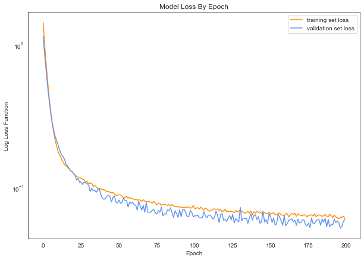
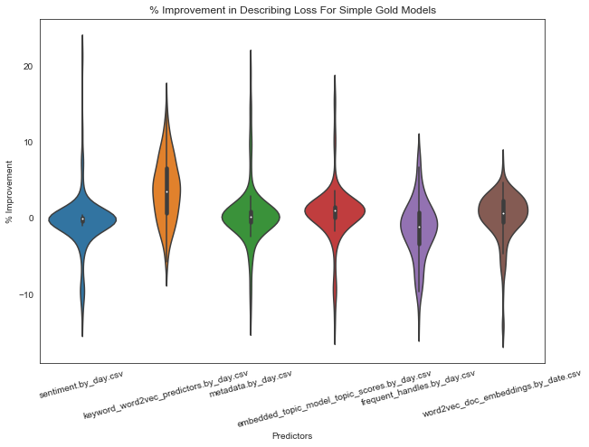

---
title: Models 
layout: default
filename: models.md
--- 

##### Initial Model Architecture:

Attempts to fit simple tree-based models (e.g. Random Forest) to stock and bond data were ineffective.

The following datasets were combined to form a hybrid predictor set: 
- Tweet metadata
- Top mentioned users
- Word2vec embeddings
- Topic scores 
- Sentiment

Predictors were combined by day, and each day's data was supplemented with the previous n days' data, where n was a hyperparameter of the model. These 'lookbacks' were at first n days of tweet-based predictors. This was further explored by also adding in previous n-1 days of responses (the stock volatility from previous days).
The resultant dataset (692 rows) was standardized and divided into a train dataset (first 595 rows) and a test dataset (last 86 rows, chronologically).
The train dataset was augmented through addition of gaussian noise, to create a dataset of size 50 times that of the original datset.

An initial hit (for modelling combined American stock volatility) was found using a 3-layer dense neural network, 
with 32 `relu` nodes per layer and a single linear output node (using the `adam` optimizer in TensorFlow to optimize mean absolute error). 
A 30% dropout rate and hybrid L1/L2 regularization were found to attenuate overfitting to the training set; 
additionally, early stopping was found to be beneficial. 

Batch normalization was investigated but found to be ineffective. 

After 200 epochs of training, the neural network was found to consistently outperform a *y*-randomized control (by 7%).  

**Figure 1**: Initial Predictions for Test Set and Training Set

**Figure 2**: Model Performance By Epoch

Permutation importance analysis of the initial model (using `eli5`) revealed that the most important tweets were those referring to the Ukraine/impeachment scandal. 

{:height="350px"}

**Figure 3**: Most Important Predictors For Initial Model

Models were fit on individual predictor sets, with dropout and predictor lookback as described in the following table. Two types of models were fit: a regression model, which attempted to estimate the amount of volatility, and a classification model whose goal it was to predict whether the response value would go up or down in a given day. 

Stocks
Individual predictor sets were fit on aggregated stock market data from the United States or from China. Performance on the American stocks, both classification and regression, was generally poor for all predictor sets.

However, performance on Chinese stocks was better, and depended on the predictor set. In general, for both classificaiton and for regression, the users either retweeted or mentioned in Trump's tweets were predictive of Chinese stock market volatility.

##### Further Development:

To more systematically probe the importance of various features and hyperparameters, full factorial optimization in predictor and hyperparameter space was carried out using the Cannon cluster. 
A 3-level dense neural network with 32 `relu` nodes per layer (and a single linear output node) was optimized using the `adam` optimizer. 
Days of lookback (between 0 and 5), dropout coefficient (between 0 and 0.5), and predictor set were systematically varied and the improvement over the average of 100 *y*-randomized controls calculated.
50-fold augmentation using random noise was carried out in all cases. 

###### American Stocks:

###### Chinese Stocks:

###### Thirty-Year Treasury Bonds:

Modelling of bond volatility was found to be largely ineffective: although various outliers gave noticeable improvements over *y*-randomized models, 
the overall distribution of model performance implied that this was merely an artifact (Figure xx). 
Accordingly, these models were not investigated further.

**Figure xx**: Effect of Different Predictor Sets on Modelling Bond Volatility

###### Gold Prices:

In contrast, modelling volatility in gold prices was more successful: in particular `word2vec`-based predictors sets gave marked improvement over *y*-randomized models (Figure xx). 
Raising dropout coefficients was found to be important to reduce the variance of the models (which is consistent with the pseudo-ensemble effect of neural networks with high dropout) (Figure xx).

**Figure xx**: Effect of Different Predictor Sets on Modelling Gold Volatility

**Figure xx**: Effect of Different Dropout Coefficients on Modelling Gold Volatility

